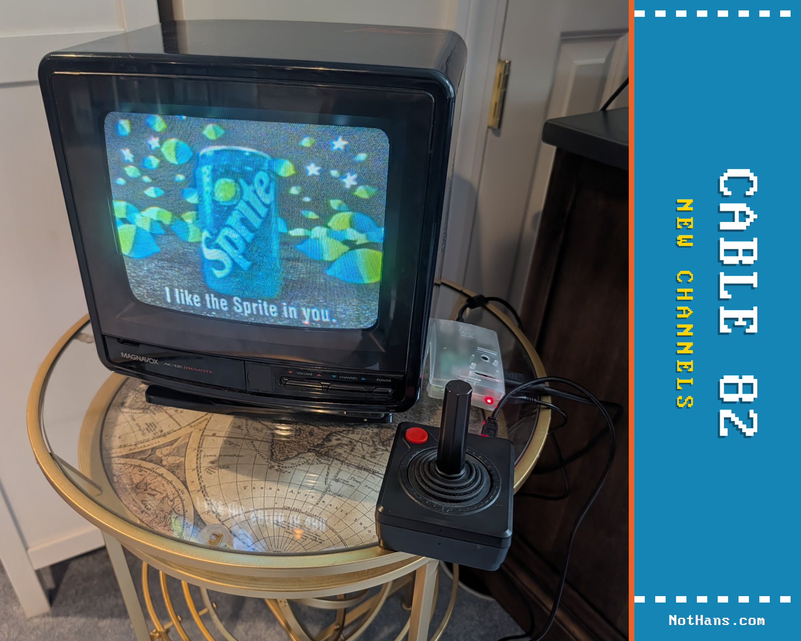
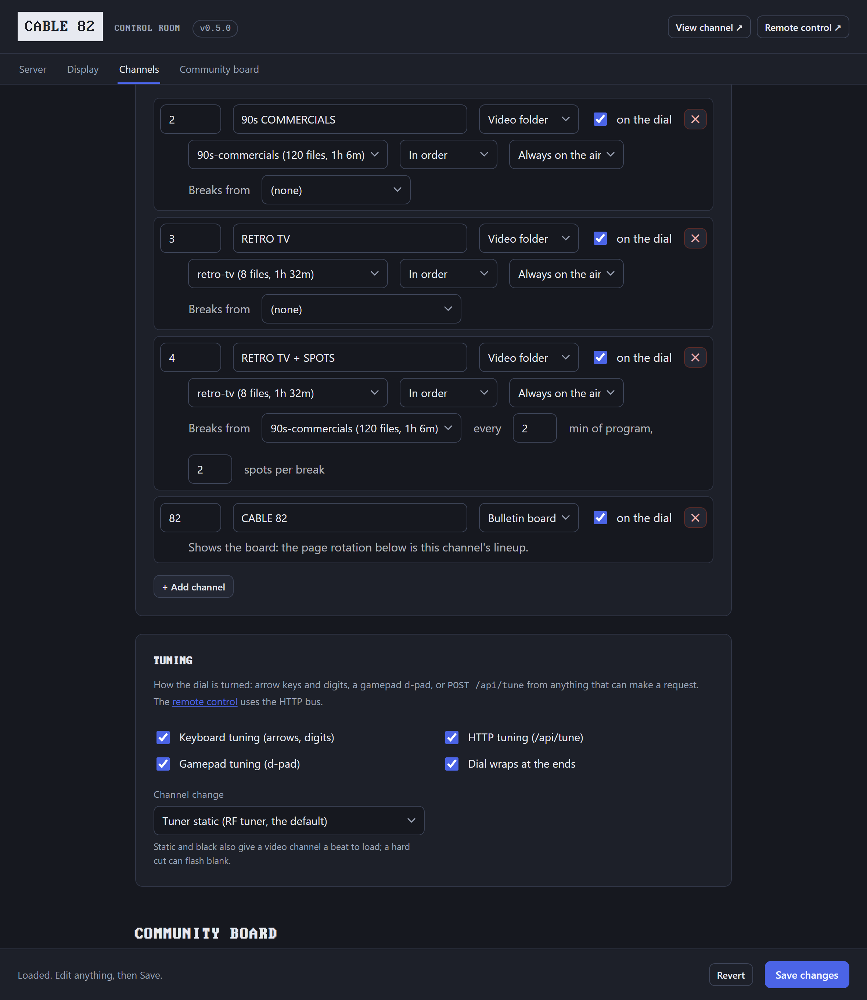
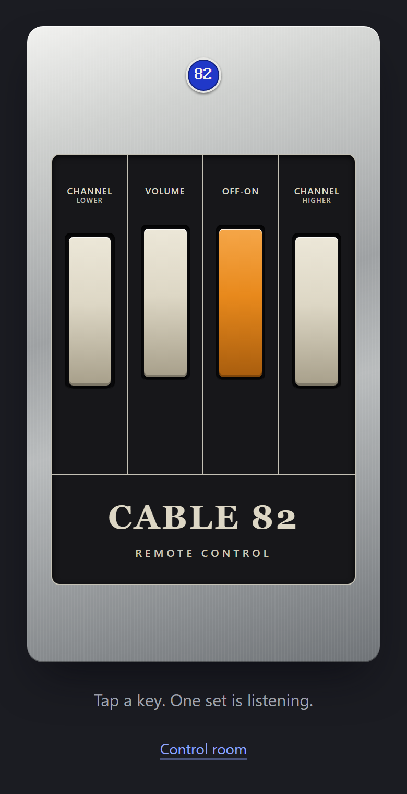
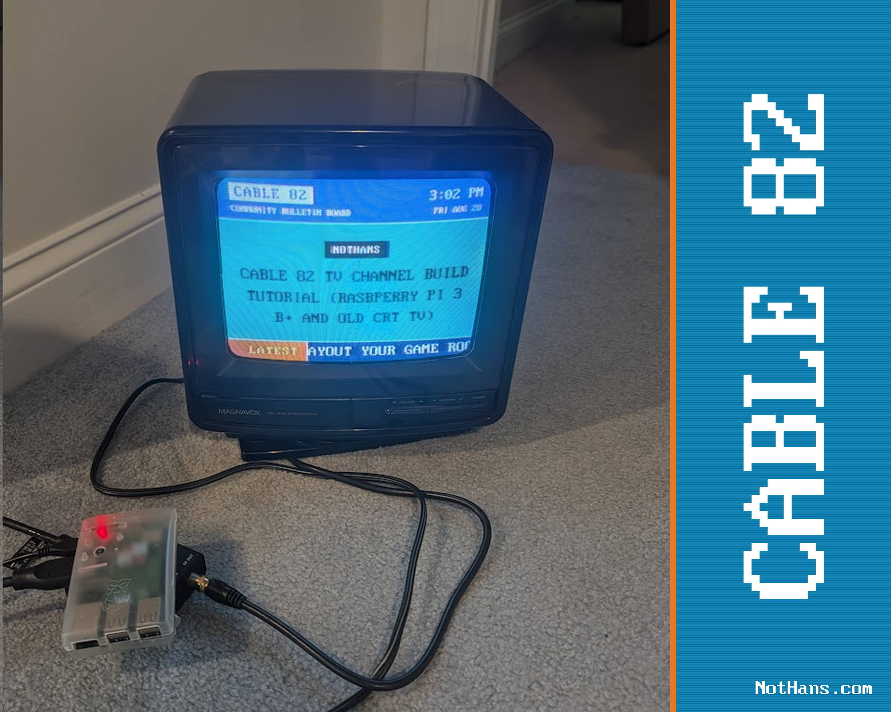

# CABLE 82

Your own cable network. You set the programming.

Before streaming, cable TV delivered programming over channels: a dial full of them, each one on the air whether you were watching or not.
CABLE 82 lets you run your own cable network.



Features:

- **Community Bulletin Board** - bundled as channel 82: your RSS feeds, news, weather, and local events.
- **Video channels** - place videos in a folder to define your own channel, like a Saturday-morning cartoon lineup or old 50s movies.
- **Commercial breaks** - give a video channel a second folder of spots and it cuts them into the program: a few minutes of movie, three commercials, back to the movie where it left off.
- **External channels** - point a channel at a website to create a channel out of anything.
- **Flexible tuning** - anything that can trigger a key press, a button press, a GPIO pin, or an HTTP request to the API can change the channel.
- **Remote control** (`/remote-control`) - a Zenith Space Command drawn in CSS: channel lower, volume, off-on, channel higher, on your phone.
- **Control Room** (`/config`) - where you tune CABLE 82 to be what you want; fully customizable and extendable, everything stored in one `config.json` file.
- **Made for CRTs** - 4:3 formatting, per-axis overscan margins, and a broadcast-safe palette.

Resources:

- Original build story: [CABLE 82 on nothans.com](https://nothans.com/cable-82-turn-a-raspberry-pi-and-an-old-crt-into-a-1982-cable-bulletin-board-channel)
- Step-by-step build tutorial: [from a blank SD card to channel 3](https://nothans.com/cable-82-tv-channel-build-tutorial-rasbperry-pi-3-b-and-old-crt-tv)
- One-minute video: [CABLE 82 on the air](https://www.youtube.com/watch?v=d5Jcfx5oN0A)
- Community Bulletin Board demo video: [the full six-minute demo](https://www.youtube.com/watch?v=0YEvI_oFfqY)

## Quick start

You need Node.js 18 or newer: `node -v` should print `v18` or higher.
(No `node` at all, or an older one?
See [Node.js on a Raspberry Pi](#nodejs-on-a-raspberry-pi) below; the same commands work on any Debian or Ubuntu machine.)

```
git clone https://github.com/nothans/cable-82
cd cable-82
node server.js
```

The server prints every address it answers on:

```
CABLE 82 broadcasting
  http://localhost:1982   (a browser on this machine)
  http://192.168.1.42:1982   (a browser on another device on your network)
Control room: http://localhost:1982/config
Remote control: http://192.168.1.42:1982/remote-control   (open it on your phone)
```

Open the first one in a browser on the same machine, or the second one from a laptop or phone on the same Wi-Fi.
You are on the air.
(If it prints something else instead, it is telling you why it could not start; see [Troubleshooting](#troubleshooting).)

Out of the box the dial carries one channel: the Community Bulletin Board on 82.
Everything from here - more channels, your name, your messages, your feeds - happens in the control room.

## The control room

Open `http://localhost:1982/config` and the whole network is on one screen: identity, the dial of channels and their schedules, feeds, channel 82's page rotation, community messages, the crawl, colors, and the CRT picture settings.
Hit Save and it's on the air in about twenty seconds, no reload.


Every change is validated on the server, written to `config.json`, and picked up on air.
If `config.json` changes while a control room is open (a hand edit, or a save from another tab), the open screen warns you, and a stale Save is refused instead of overwriting the newer file.
Everything lives in `config.json`; edit it directly in a text editor and the air still updates.
The keys are listed in the [configuration reference](#configuration-reference-configjson).

## Channels

A dial of channels you flip through with a keyboard, a USB gamepad or joystick, or an HTTP call, all inside the one browser that's already on the air.
The control room's Channels panel is where you build it: add a channel, give it a number and a name, pick its type, and it's on the dial.



Three kinds of channel:

- **Bulletin** - the bundled [Community Bulletin Board](#channel-82-the-community-bulletin-board). Its lineup is the page rotation.
- **Video** - a folder of video files under [`channels/`](channels/README.md), played in order on a *broadcast clock*: the channel's position is computed from the wall clock, so tuning away and back lands you mid-program, like real TV. Play in filename order or shuffled fresh each day. No videos of your own yet? `node channels/fetch-demo-channel.js` downloads **RETRO TV** - eight public-domain films from the Internet Archive's Prelinger collection (Duck and Cover, Design for Dreaming, One Got Fat...) - and you have a channel.
- **External** - any URL in a frame; point one at [ws4kp](https://github.com/netbymatt/ws4kp) for a weather channel.

A video channel can run around the clock or keep **scheduled hours** - dayparts like Saturday and Sunday 8:00 to 11:30.
A window whose end time is at or before its start runs overnight into the next morning, so "Saturday 20:00 to 01:00" is one window, not two.
Off the air it shows a test card with the resume time, color bars, or static - or falls back to the board.
The control room draws the week as a grid so you can see the schedule at a glance.

A video channel can also take **commercial breaks**: pick a second folder for the spots, say how many minutes of program run between breaks, and how many spots fill each one.
Each program is cut into even acts of about that length, a break follows every act, the last one included, so a break also separates each program from the next.
The spots cycle through their folder in order (shuffled daily if the channel is), and the movie picks up where the break cut in.
The breaks live on the broadcast clock like everything else, so tune in mid-break and you get the spot in progress.
Set the minutes to 0 for breaks only between programs.

Tuning:

- **Keyboard** - arrows or PageUp/PageDown to change channel, digits plus Enter to jump straight to a number.
- **Gamepad** - a USB NES-style controller: up/down on the pad changes channel, Select jumps home to the board.
- **Remote control** - open `/remote-control` on a phone: four keys styled after the 1960s Zenith Space Command, channel lower, volume, off-on, channel higher. The volume key steps loud, sound off, soft, medium, back to loud, like the motorized original. Off-on darkens the set; the broadcast clock keeps running, so on comes back to the program already in progress. The set remembers its volume and power state across a reload.
- **HTTP** - `POST /api/tune` with `{"cmd":"up"}`, `{"cmd":"down"}`, `{"cmd":"set","channel":2}`, `{"cmd":"volume"}`, or `{"cmd":"power"}`. GPIO buttons, a Stream Deck, or anything that can make a request becomes a remote control.



Channel changes cover the cut with a beat of tuner static, then show a channel banner, exactly like a rented cable box.
If the box you grew up with went black between channels instead, set `tuner.cut` to `black` in the control room (`none` is a hard cut).
The tune API is meant for your LAN and is deliberately unauthenticated - anyone on your network can change the channel, which is also how a living room works.
Don't expose it to the internet.

### Tuner API

The server also offers `GET /api/channels`, the folder inventory.
For anyone building their own tuner source or listener (the bus carries events, not state, so a remote never fights the buttons):

- `POST /api/tune` takes `{"cmd":"up"}`, `{"cmd":"down"}`, `{"cmd":"set","channel":N}`, `{"cmd":"volume"}` (one step around the volume cycle), or `{"cmd":"power"}` (toggle the picture off and on) and answers `{"ok":true,"seq":N,"listeners":N}`. Volume and power are events too: the display holds the level and the on/off state, not the server.
- `GET /api/tune` answers `{"seq":N,"last":{...},"listeners":N}` - the last command and how many displays are listening, useful for checking a remote is wired up. It never reports a current channel, because the server doesn't hold one.
- `GET /api/events` emits `hello` (`{"seq":N,"build":"..."}`, your baseline on connect and reconnect; `build` is a hash of the display files, and a display that reconnects to a different one reloads), `tune` (a command with its `seq` - apply each seq once), and `config` (`{"version":...}` after a control-room save - the display reloads on it).
- Both tune endpoints answer 403 while HTTP tuning is switched off in the control room.
- `POST /api/channels/durations` is internal - the display reporting probed video durations back to the server's cache. It requires the same `x-cable82-config: 1` header as config saves.

## Channel 82: the Community Bulletin Board

Every cable system had one, somewhere on the dial: the community channel. This is channel 82.



1. **Header band** - channel name and the live time and date, always visible.
2. **Pages** - full-screen colored pages that hard-cut every 12 seconds: a big clock, your community messages, DID YOU KNOW facts, DAD JOKE groaners, a WEATHER card, and headlines.
3. **The crawl** - a continuous ticker of headlines along the bottom, fed by RSS.

The WEATHER card is fed by Open-Meteo (free, no account): current conditions, hi/lo, and sunrise/sunset for a location you pick in the control room.
(For a full weather *channel*, put [ws4kp](https://github.com/netbymatt/ws4kp) on the dial as an external channel.)

| The time | The weather | A dad joke |
| :---: | :---: | :---: |
|  |  |  |

### Channel 82 Background Music

Add audio files into the [`music/`](music/) folder and channel 82 plays them as a continuous background bed behind its pages, looping the whole set (shuffle optional).

Browsers block autoplay until a user gesture, so on a desktop the music starts on your first click; on the Pi kiosk the `--autoplay-policy=no-user-gesture-required` flag below starts it from boot.

### CheerLights

The crawl carries one extra item: the latest [CheerLights](https://cheerlights.com) color.
CheerLights is a single global color that anyone in the world can set, and every connected light on the planet follows along.
CABLE 82 checks it about once a minute (server-side, like every other fetch) and scrolls your message with the color name filled in: `THE WORLD IS SET TO {COLOR}` comes out as `THE WORLD IS SET TO PURPLE`.


Turn it off, or make the message yours, in the control room - or in `config.json`:

```json
"cheerlights": {
  "enabled": true,
  "template": "THE WORLD IS SET TO {COLOR}"
}
```

## Configuration reference (`config.json`)

Everything the control room edits lives in `config.json`, and you can hand-edit it just as well.

| Key | What it does | Default |
| --- | --- | --- |
| `channelName`, `tagline` | Header identity and crawl fallback text | `CABLE 82` |
| `timeFormat` | `"12h"` or `"24h"` | `12h` |
| `port` | Server port | `1982` |
| `channels` | The dial: `{ number, name, type, enabled }` plus per-type fields - video channels add `folder`, `order` (`sequence`/`shuffle-daily`), `mode` (`continuous`/`schedule`), `schedule` windows (`{ days, start, end }`), `offAir` (`testcard`/`bars`/`snow`/`bulletin`), and optionally `breaks` (`{ folder, everyMinutes, spots }`: a second folder of spots cut in every `everyMinutes` minutes of program (0 to 240; 0 means only between programs), `spots` spots per break (1 to 20)); external channels add `url`. Empty means the board alone as channel 82 | the board on 82 |
| `tuner` | Which tuning inputs are live (`sources.keyboard`, `sources.gamepad`, `sources.http`), whether the dial wraps at the ends (`wrap`), and what covers a channel change (`cut`: `static`/`black`/`none`) | all on, wraps, static |
| `rotation` | Channel 82's page lineup, in order (`clock`, `messages`, `facts`, `dadjokes`, `weather`, `headlines`) | see file |
| `pageSeconds` | Seconds per page | `12` |
| `feeds` | RSS/Atom feeds: `{ id, label, url }`. The server only ever fetches these URLs | WBUR, Hacker News, nothans.com |
| `refreshMinutes` | Feed re-fetch interval | `10` |
| `maxItemsPerFeed` | Items kept per feed | `20` |
| `crawl` | Which feeds ride the ticker, speed, separator, and the fixed `flag` label pinned to its left | all feeds, `LATEST` |
| `messages` | Your community messages: `{ text, color? }` | examples |
| `facts` | Fun facts shown under a DID YOU KNOW card, one string each | 30-plus samples |
| `dadJokes` | Dad jokes shown under a DAD JOKE card, one string each | 15 samples |
| `weather` | One weather strip via Open-Meteo: `location` (geocoded, with `timezone`), `tempUnit` (`F`/`C`), `windUnit` (`mph`/`kmh`). Set it in the control room | Boston, `F`, `mph` |
| `music` | Background music from the `music/` folder: `enabled`, `shuffle`, `volume` (0-100) | on, shuffled, 60 |
| `cheerlights` | The latest [CheerLights](https://cheerlights.com) color as a crawl item: `enabled`, `template` (`{color}` becomes the color name) | on, `THE WORLD IS SET TO {COLOR}` |
| `colors` | `pageCycle`, `headerBg`, `crawlBg` | period palette |
| `overscanPercent` | Safe margin for CRT overscan, 0-15; the fallback for both axes | `7` |
| `overscanX`, `overscanY` | Per-axis overscan margins, 0-15; tubes rarely crop evenly | `overscanPercent` |
| `crtMode` | Softer NTSC-safe palette and no drop shadow, for composite or RF | `false` |
| `crtInkText` | Dark text on color pages while CRT mode is on; white smears on some tubes | `false` |
| `textScale` | Enlarges body, kicker, crawl, and small header text, 1-1.5 | `1` |
| `dailyReloadHour` | Daily kiosk self-reload hour, or `false` | `4` |

Colors are palette names: `blue`, `cyan`, `green`, `yellow`, `red`, `magenta`.
The palette is broadcast-safe on purpose; raw hex works too if you must.

Feeds are fetched by the server, never by the browser, and only URLs listed in `config.json` can be fetched at all.
If a feed goes down, the channel keeps running on the last good copy.
If the network dies entirely, the clock, messages, and facts keep going forever.

## Running it on a real CRT (Raspberry Pi)

Everything below was run end to end on a Raspberry Pi 3 Model B+ with Raspberry Pi OS (64-bit) "Trixie" and a 1987 Magnavox portable over an HDMI-to-RF modulator on channel 3; the [build tutorial](https://nothans.com/cable-82-tv-channel-build-tutorial-rasbperry-pi-3-b-and-old-crt-tv) walks the same ground with photos.

### Node.js on a Raspberry Pi

Raspberry Pi OS does not ship with Node.js, and the version its own `apt` offers depends on the OS release: Bookworm (2023) and Trixie (2025) give Node 18 or 20, which work; Bullseye (2021) and older give Node 12, which does not.
The sure way on a 64-bit image, any Pi from the 3 onward:

```
curl -fsSL https://deb.nodesource.com/setup_22.x | sudo -E bash -
sudo apt-get install -y nodejs
node -v
```

`node -v` should now print `v22`.
NodeSource builds for 64-bit only these days; on a 32-bit image use `sudo apt install nodejs` and take the distro's Node 20.
A Pi 1, Pi Zero, or Zero W is ARMv6: Node 20 installs from `apt` and the server runs, but no current browser runs on that chip (Chromium refuses it outright), so it can be the server and never the TV.
A Pi 2 runs the bulletin board; video channels want a Pi 3 B+ or newer (H.264 up to ~480p decodes comfortably in software there; measured on the 3 B+).

Then clone and start it exactly as in Quick start, and read the addresses it prints.

### 1. Power it properly

A Pi 3 wants a 5V 2.5A supply and a short, thick micro-USB cable; a phone charger will boot it and then quietly run it at less than half speed.
Check:

```
vcgencmd get_throttled
```

`throttled=0x0` is the answer you want.
Anything else is a complaint: `0xd0005` means under-voltage and throttling right now (and that both have happened since boot), and `vcgencmd measure_clock arm` will show a 1.4GHz Pi idling at 600MHz.
(`0x80008` on a 3 B+ is its own soft temperature limit at 60C, normal with Chromium running, and not a power problem.)

### 2. Run the server on boot

`/etc/systemd/system/cable82.service`:

```
[Unit]
Description=CABLE 82
After=network-online.target

[Service]
ExecStart=/usr/bin/node /home/pi/cable-82/server.js
Restart=always
User=pi

[Install]
WantedBy=multi-user.target
```

Replace `pi` (both places) with your own username if it differs: `whoami` tells you, and newer Raspberry Pi OS images let you pick any name at setup.
`which node` confirms the path on the `ExecStart` line.
Then `sudo systemctl enable --now cable82`, and `systemctl status cable82` should say `active (running)` with the broadcasting lines in its log.
When a new release comes out, see [Updating](#updating): one line, and the TV takes care of itself.

### 3. Chromium in kiosk mode

The Raspberry Pi OS desktop logs in by itself and runs a Wayland session (the compositor is labwc).
Put this in `~/.config/labwc/autostart` and it opens Chromium full screen on the channel at every login:

```
# CABLE 82 kiosk: wait for the channel server, then put Chromium on it full screen.
until curl -s -o /dev/null http://localhost:1982; do sleep 1; done
/usr/bin/lwrespawn /usr/bin/chromium http://localhost:1982 \
  --kiosk --noerrdialogs --disable-infobars --no-first-run --no-memcheck \
  --disable-lcd-text --autoplay-policy=no-user-gesture-required \
  --enable-features=OverlayScrollbar --password-store=basic --start-maximized &
```

The `until curl` loop keeps Chromium from winning the race at boot and showing "localhost refused to connect" forever.
`lwrespawn` restarts the browser if it ever dies.
`--no-memcheck` silences Chromium's low-memory warning on a 1GB Pi, `--disable-lcd-text` keeps the chunky text from going pink at the edges, `--autoplay-policy=no-user-gesture-required` lets the music start without a click, and `--password-store=basic` stops the keyring prompt.
(On Bookworm and earlier the binary was `chromium-browser` and the autostart file was `/etc/xdg/lxsession/LXDE-pi/autostart`; Trixie has neither.)

Then stop the screen from blanking:

```
sudo raspi-config nonint do_blanking 1
```

If a pointer shows up on the TV with no mouse attached (the HDMI CEC input counts as one), give labwc a key that hides it and press it from the autostart.
Copy `/etc/xdg/labwc/rc.xml` to `~/.config/labwc/rc.xml`, add inside `<keyboard>`:

```
<keybind key="A-W-h"><action name="HideCursor"/></keybind>
```

then `sudo apt install wtype` and append to the autostart:

```
(sleep 10; wtype -M alt -M logo -P h -p h -m logo -m alt) &
```

### 4. Get the picture onto the TV

Two ways in, depending on your TV.

**Coax / antenna input (works on any Pi and any TV):** run HDMI from the Pi into an [HDMI-to-RF modulator](https://www.amazon.com/dp/B0DRCZKLBQ?tag=nothans), coax from the modulator into the TV's antenna terminal, and tune the TV to **channel 3 or 4** to match the switch on the box.
Two things the box will not tell you:

- It scales whatever comes in to fill the 4:3 tube, so the Pi has to send a 4:3 picture or the channel arrives squashed.
- Cheap ones send no EDID at all, so the Pi sees no screen, guesses a mode, and refuses to send HDMI audio.

Fix both.
Append to the single line in `/boot/firmware/cmdline.txt`:

```
video=HDMI-A-1:640x480@60D vc4.force_hotplug=1 drm.edid_firmware=HDMI-A-1:edid/cable82.bin
```

and give the Pi the EDID that file names, a 256-byte description of a 640x480 screen with stereo audio that ships in this repo:

```
sudo mkdir -p /lib/firmware/edid
sudo cp edid/cable82-640x480-audio.bin /lib/firmware/edid/cable82.bin
```

The desktop picks its own resolution on top of the kernel's, so pin it in `~/.config/kanshi/config`:

```
profile crt {
  output HDMI-A-1 mode 640x480 position 0,0
}
```

Reboot, and `wpctl status` should now list an HDMI sink next to the headphone jack.
Make it the default and give it some level; WirePlumber remembers:

```
wpctl status                       # find the "(HDMI)" sink's number
wpctl set-default <number>
wpctl set-volume <number> 0.8
```

The modulator puts the sound on the channel's audio carrier, mono, the way 1982 did.

**Composite (Pi Zero, 1, 2, 3 via the yellow jack or the 3.5mm AV jack, Pi 4 via the AV jack; TV with an RCA input):**

```
sudo raspi-config nonint do_composite 0
```

writes `dtoverlay=vc4-kms-v3d,composite` to `config.txt`, and on every Pi before the 5 that also turns HDMI off: it is one or the other.
The Wayland desktop does not trust the composite connector until it is told the mode, so append to `cmdline.txt`:

```
video=Composite-1:720x480@60ie,tv_mode=NTSC
```

(PAL: `720x576@50ie,tv_mode=PAL`.)
Audio routes itself to the analog jack when HDMI is off.
If the picture is wavy or rolling and the sound is fine, the 4-pole AV cable is wired the camcorder way: move the **red** plug to the TV's video input.
The old `enable_tvout` / `sdtv_mode` / `sdtv_aspect` lines you will find in older guides do nothing on Bookworm or later.

### 5. Tune it in the control room

Open the **CRT** panel in the control room:

- **CRT mode** swaps in a softer palette and drops the drop shadow.
  Composite and RF smear saturated red and blue and clip pure white; this calms both.
- **Text size** enlarges the body text, kicker, crawl, and the small header lines, 1 to 1.5.
  1.25 is a good start on a small tube; the big clock stays as it is.
- **Dark text on color pages** trades the white page text for ink; white smears on some tubes, and the only way to know yours is to flip it and look.
- **Overscan margins**, now one per axis: tubes rarely crop evenly, so give the sides and the top/bottom each what your set eats.

Pages fit themselves to whatever is left: a long fact or the weather card shrinks just enough, and the weather card gives up its sunrise line first.
There are no fake scanline filters in CABLE 82: the CRT is the filter.

## Updating

An update is a `git pull` and a restart.
Your settings, schedules, videos, and music are yours and stay put.

```
cd cable-82
git pull
node server.js
```

On a Pi running the service, restart the service instead of starting the server by hand:

```
cd ~/cable-82 && git pull && sudo systemctl restart cable82
```

The display updates itself.
When the server comes back, the set reconnects to the tuner bus, sees a new build, and reloads onto the new files within a few seconds; the broadcast clock puts the program back where it belongs, on the same channel, at the same volume.
Nobody touches the TV or the kiosk.

`config.json`, your folders under `channels/`, and your own tracks in `music/` are not tracked by git, so an update never changes a setting, a schedule, a video, or a song.
Releases and what changed in each are at [github.com/nothans/cable-82/releases](https://github.com/nothans/cable-82/releases); `git describe --tags` names the one you are on.

## Troubleshooting

**"localhost refused to connect"** means nothing is listening on that port, so the server is not running.
Open a terminal on the Pi, `cd cable-82`, run `node server.js`, and read what it prints.
It either says `CABLE 82 broadcasting` with a list of addresses, or it tells you why it could not start:

- `node: command not found`: Node.js is not installed. See [Node.js on a Raspberry Pi](#nodejs-on-a-raspberry-pi).
- `CABLE 82 needs Node.js 18 or newer`: the Node.js you have is too old (Raspberry Pi OS Bullseye's `apt` gives Node 12). Same fix.
- `PORT 1982 IS ALREADY IN USE`: a copy is already running, probably the systemd service. That copy is the channel; open the browser at it, or stop it with `sudo systemctl stop cable82` while you test by hand.
- Anything else: the message is the clue. Paste it into an issue and it will get answered.

While the server is running, prove it from the Pi itself, no browser involved: `curl -s http://localhost:1982 | head -3` should print the start of a web page.

**The browser is on a different device than the server.**
`localhost` always means "this device", so `http://localhost:1982` on a laptop looks for a server on the laptop.
Use one of the other addresses the server printed, the ones with a `192.168.x.x`-style IP; `hostname -I` on the Pi prints the same IPs.
The `192.168.1.42` in these docs is an example, not your Pi's address.

**"Address unreachable"** means that IP is not on your network or is not the Pi: use the address the server printed, and make sure the Pi and the browsing device are on the same Wi-Fi or LAN.

**"raspberrypi.local" does not resolve** when the Pi's hostname is not `raspberrypi` (newer images let you choose), or when the browsing device lacks mDNS (older Windows, some Android).
`hostname` on the Pi shows its name; the IP address works regardless.

**The picture is there but the text is smeared or the colors bleed.**
That is NTSC doing what it does to saturated color and small type.
Turn on CRT mode and raise Text size in the control room's CRT panel, then fine-tune the TV; a 1980s tuner drifts, and cheap modulators sit slightly off the carrier.

**No sound through the HDMI modulator.**
The Pi refuses HDMI audio unless the screen's EDID says it can hear, and cheap modulators send no EDID.
Step 4 above supplies one (`drm.edid_firmware=` plus the shipped `edid/cable82-640x480-audio.bin`); after a reboot `wpctl status` lists an HDMI sink.

**It runs, slowly, and `vcgencmd get_throttled` is not `0x0`.**
The power supply.
A Pi 3 on a phone charger runs at 600MHz with under-voltage flags set; a 5V 2.5A supply and a short cable fix it.

**The board is up but feeds, weather, or CheerLights are blank.**
The clock, messages, facts, and jokes never need the network; the rest is fetched by the server.
`journalctl -u cable82 -f` (or the terminal) logs each fetch failure with the reason.

**The systemd service will not start**: `systemctl status cable82` shows why.
The usual suspects are `User=` naming an account that does not exist, `ExecStart=` pointing at a `node` that is not at `/usr/bin/node` (`which node`), or the repo living somewhere other than `/home/pi/cable-82`.

## Testing

- Server: `node --test test/server.test.mjs` - config validation (commercial breaks included), feeds, the channels API, the tuner bus (the remote's keys included), and Range serving.
- Client pure functions: start the server and open `http://localhost:1982/test/harness.html` - the broadcast clock, schedules (overnight windows included), playlist order, the timeline of a channel with breaks cut in, the dial, and the volume cycle.
- Tuner drill: with more than one channel on the dial, `curl -X POST http://localhost:1982/api/tune -H "content-type: application/json" -d "{\"cmd\":\"up\"}"` and watch the display change channels - the whole bus in one command.
- Failure drill: `node server.js --chaos` serves mock feeds that randomly hang and fail, so you can watch channel 82 shrug it off.
- Soak: open `http://localhost:1982/?soak=1` for accelerated channel-82 page flips and refreshes with stats logged to the console.

## Credits

- Typeface: [The Ultimate Oldschool PC Font Pack](https://int10h.org/oldschool-pc-fonts/) by VileR (CC BY-SA 4.0), the IBM VGA 8x16 face. See `fonts/LICENSE.txt`.
- Weather data from [Open-Meteo](https://open-meteo.com/) (free, no API key; CC BY 4.0).
- ws4kp project, a web-based WeatherStar 4000: [ws4kp](https://github.com/netbymatt/ws4kp).

## License

MIT for the code (see `LICENSE`).
The bundled font remains CC BY-SA 4.0.
