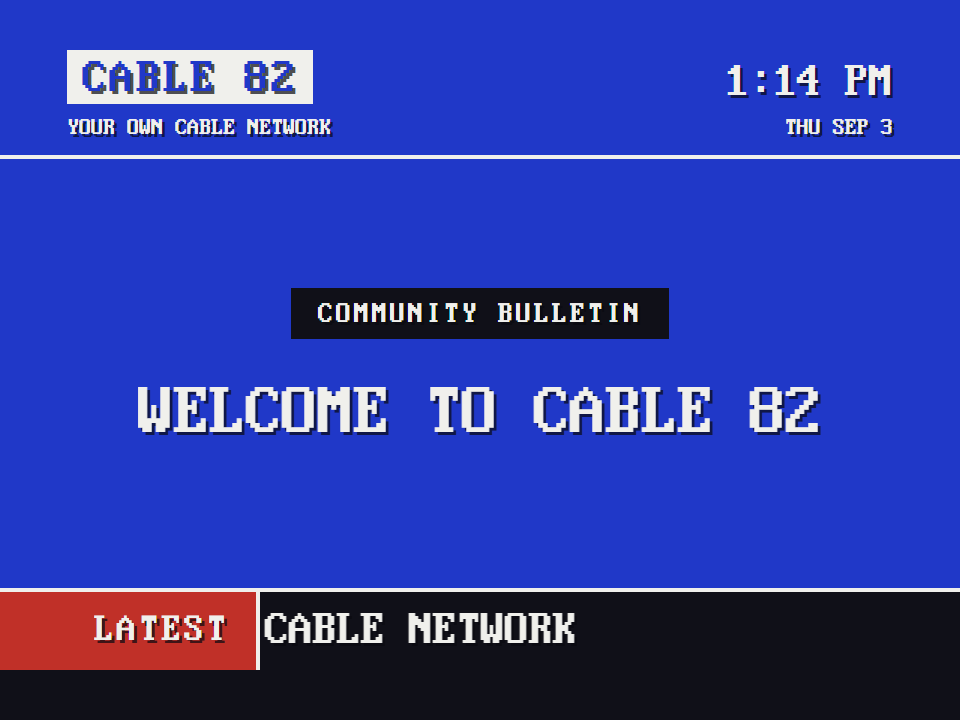
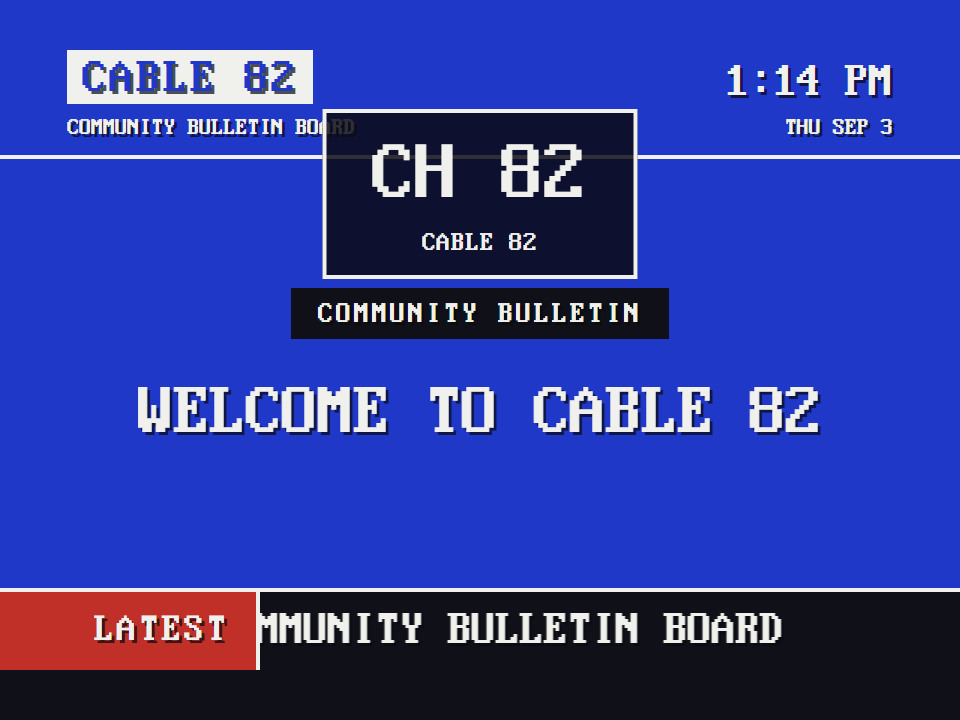
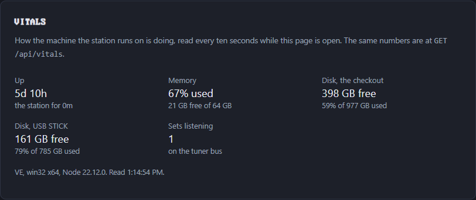
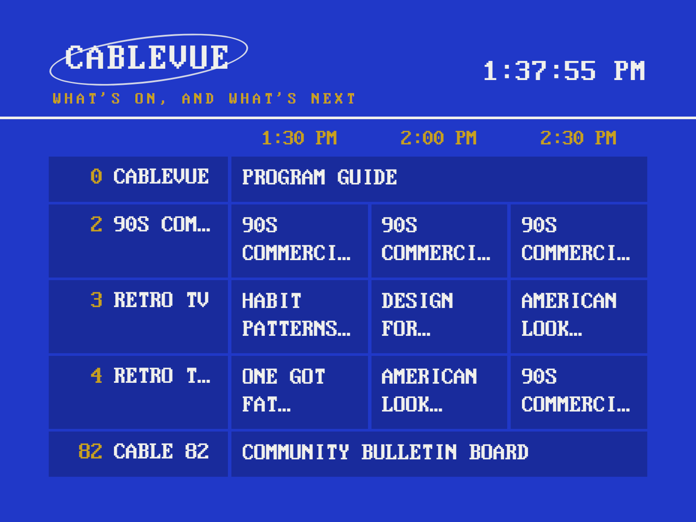
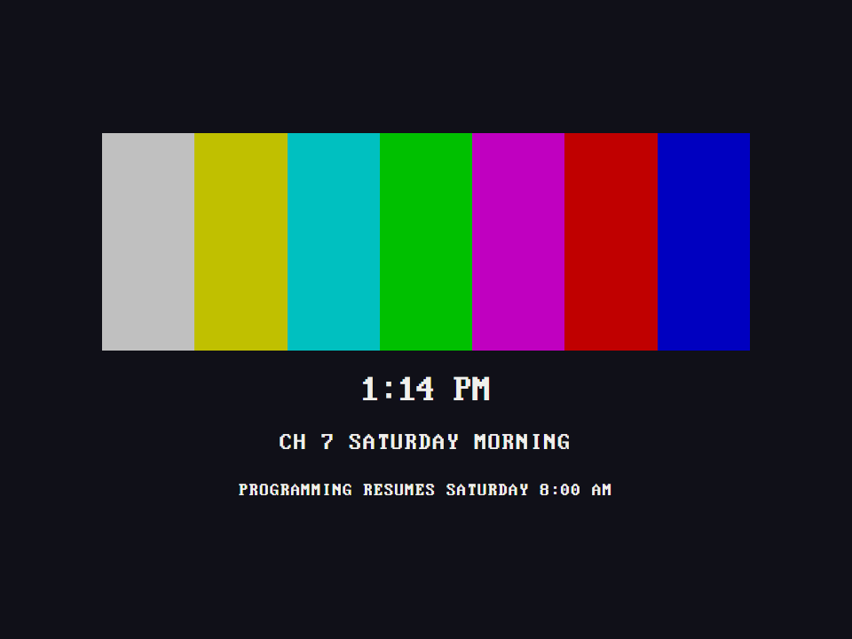
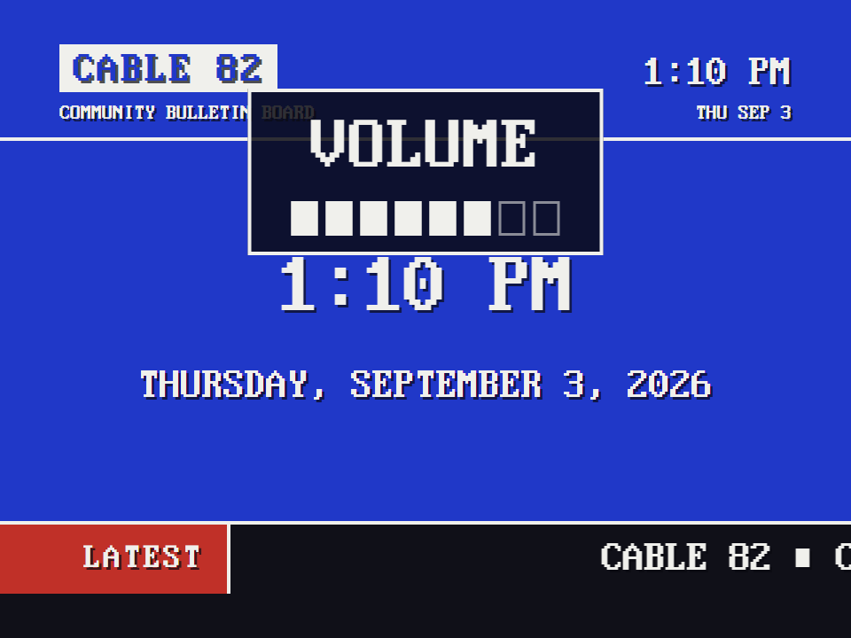

# CABLE 82

Your own cable network. You set the programming.

Before streaming, cable TV delivered programming over channels: a dial full of them, each one on the air whether you were watching or not.
CABLE 82 lets you run your own cable network, in one browser, from one dependency-free Node server, on anything from a laptop to a Raspberry Pi feeding a 1987 television.



Features:

- **Community Bulletin Board** - channel 82, out of the box: your messages, the time, fun facts, dad jokes, the weather, and headlines from your RSS feeds, with a crawl along the bottom and music behind it.
- **Video channels** - put videos in a folder and it is a channel, playing on a *broadcast clock*: tune away and back and you land mid-program, like real TV. Saturday-morning cartoons, old movies, a whole series in order.
- **Scheduled hours** - a channel that is on the air Saturday 8:00 to 11:30 and shows a test card the rest of the week, with the time it comes back.
- **Commercial breaks** - a second folder of spots, cut into the program every so many minutes, the movie picking up where it left off.
- **CABLEVUE** - the guide on channel 0: what is on every channel now and next, half hour by half hour, crawling when the lineup is long.
- **Channels on any drive** - a `channels` folder on a USB stick or a network share joins the dial. A 16 GB card fills up fast; a stick does not.
- **External channels** - any web page as a channel. A retro weather app makes a fine weather channel.
- **Tuning from anything** - the keyboard, a USB gamepad, an HTTP call, or the **remote control** at `/remote-control` on your phone: channel up, channel down, volume, power.
- **An on-screen display** the way a cable box drew one: the channel on every tune, the volume as a meter of cells, centered in the picture on a dark plate.
- **The control room** at `/config` - everything, one page, one Save. The set picks the change up at once.
- **Switches off like a tube** - the picture folds into a bright line, snaps to a dot, and the phosphor fades. On, it blooms back open.
- **Made for CRTs** - 4:3 composition, per-axis overscan margins, a broadcast-safe palette, and a softer one for composite and RF.

Resources:

- Original build story: [CABLE 82 on nothans.com](https://nothans.com/cable-82-turn-a-raspberry-pi-and-an-old-crt-into-a-1982-cable-bulletin-board-channel)
- Step-by-step build tutorial: [from a blank SD card to channel 3](https://nothans.com/cable-82-tv-channel-build-tutorial-rasbperry-pi-3-b-and-old-crt-tv)
- Explainer video: [Run Your Own Cable Network Like it is 1982](https://www.youtube.com/watch?v=KROAE0mn7vo)
- One-minute video: [CABLE 82 on the air](https://www.youtube.com/watch?v=d5Jcfx5oN0A)
- Community Bulletin Board demo video: [the full six-minute demo](https://www.youtube.com/watch?v=0YEvI_oFfqY)
- Reference: [the API](docs/api.md) and [the configuration file](docs/config.md)

## Quick start

You need Node.js 18 or newer: `node -v` should print `v18` or higher.
(No `node` at all, or an older one?
See [Node.js on a Raspberry Pi](#nodejs-on-a-raspberry-pi) below; the same commands work on any Debian or Ubuntu machine.)

```
git clone https://github.com/nothans/cable-82
cd cable-82
node server.js
```

The server prints every address it answers on:

```
CABLE 82 broadcasting
  http://localhost:1982   (a browser on this machine)
  http://192.168.1.42:1982   (a browser on another device on your network)
Control room: http://localhost:1982/config
Remote control: http://192.168.1.42:1982/remote-control   (open it on your phone)
```

Open the first one in a browser on the same machine, or the second one from a laptop or phone on the same Wi-Fi.
You are on the air.
(If it prints something else instead, it is telling you why it could not start; see [Troubleshooting](#troubleshooting).)



Out of the box the dial carries two channels: the Community Bulletin Board on 82, which is where a fresh set signs on, and CABLEVUE, the guide, on 0.
Press the up arrow to turn the dial, or type a number.
Everything from here - more channels, your name, your messages, your feeds - happens in the control room.
`node server.js --help` lists the few flags there are; they are in the [command line](docs/api.md#command-line) table.

## The control room

Open `http://localhost:1982/config` and the whole network is on one screen, in six groups:

1. **Quick settings** - what a station touches week to week: the station's name and tagline, the community messages, and the music.
2. **Channels** - the dial and its schedules, and how the dial is turned.
3. **Community Board** - the rest of channel 82: the page rotation, colors, facts and jokes, weather, feeds, the crawl, CheerLights.
4. **Channel Preview** - channel 0: the guide's name and tagline, the grid, and its color.
5. **Display** - the set: CRT mode, text size, overscan, clock format, and the daily reload that keeps a kiosk healthy.
6. **Server** - the machine's vitals, the port, restart and shut down on a Pi, and the release you are running.

The bar under the masthead jumps between the groups and follows you as you scroll; `#quick`, `#channels`, `#board`, `#preview`, `#display`, and `#server` are links you can bookmark.
It is one page with one Save, so a change anywhere goes out in the same click: the server tells every display at once and the set reloads itself onto the new settings, on the same channel.
The masthead carries the release you are running, linked to its notes, and links to the display and the remote.


Every change is validated on the server, written to `config.json`, and picked up on air.
If `config.json` changes while a control room is open (a hand edit, or a save from another tab), the open screen warns you, and a stale Save is refused instead of overwriting the newer file.
If a hand edit leaves the file unreadable, the last good settings stay on the air, the control room names the line that broke, and a Save writes a good file over it.
Every key is documented in the [configuration reference](docs/config.md).

The Server group's **Vitals** panel shows how the machine is doing, refreshed every ten seconds: uptime, load, memory and swap, the CPU's temperature, the Pi's power flags (under-voltage is the sign of a phone charger standing in for a supply), and the free space on the card and on every drive that carries channels.



## Channels

A dial of channels you flip through with a keyboard, a USB gamepad or joystick, the remote, or an HTTP call, all inside the one browser that is already on the air.
The control room's Channels group is where you build it: add a channel, give it a number and a name, pick its type, and it is on the dial.


Four kinds of channel:

- **Bulletin** - the bundled [Community Bulletin Board](#channel-82-the-community-bulletin-board). Its lineup is the page rotation.
- **Video** - a folder of video files under [`channels/`](channels/README.md), played in order on a *broadcast clock*: the channel's position is computed from the wall clock, so tuning away and back lands you mid-program, like real TV. Play in filename order or shuffled fresh each day. No videos of your own yet? `node channels/fetch-demo-channel.js` downloads **RETRO TV** - eight public-domain films from the Internet Archive's Prelinger collection (Duck and Cover, Design for Dreaming, One Got Fat...) - and you have a channel.
- **Guide** - **CABLEVUE** on channel 0, the preview channel: a grid of what is on every channel now and next. It reads the same dial and the same broadcast clock the tuner runs on, so it cannot disagree with the picture. A program running long spans its columns, a commercial break is never listed (the guide names the program it sits inside), and the lineup crawls when it is taller than the screen. Its name, tagline, grid, and background live in the control room's **Channel Preview** group, and it follows the same CRT settings the rest of the set does.
- **External** - any URL in a frame; point one at [ws4kp](https://github.com/netbymatt/ws4kp) for a weather channel.



What the guide calls a video channel's programs is the channel's choice, on its row in the dial: the file names (cleaned up: `02 Design for Dreaming (1956).mp4` reads DESIGN FOR DREAMING (1956)), the titles written inside the files (what ffmpeg, HandBrake, or iTunes put there; read once and cached beside the videos), or one fixed name for the whole channel, so a folder of commercials says COMMERCIALS whatever the files are called.

A video channel can run around the clock or keep **scheduled hours** - dayparts like Saturday and Sunday 8:00 to 11:30.
A window whose end time is at or before its start runs overnight into the next morning, so "Saturday 20:00 to 01:00" is one window, not two.
Off the air it shows a test card with the resume time, color bars, or static - or falls back to the board.
The control room draws the week as a grid so you can see the schedule at a glance.



A video channel can also take **commercial breaks**: pick a second folder for the spots, say how many minutes of program run between breaks, and how many spots fill each one.
Each program is cut into even acts of about that length, a break follows every act, the last one included, so a break also separates each program from the next.
The spots cycle through their folder in order (shuffled daily if the channel is), and the movie picks up where the break cut in.
The breaks live on the broadcast clock like everything else, so tune in mid-break and you get the spot in progress.
Set the minutes to 0 for breaks only between programs.

### Channels on another drive

A library does not have to fit on the card the system boots from.
Put a `channels` folder at the top of a USB drive, a spinning disk, or a mounted network share, drop your folders inside it, and they appear in the picker alongside the built-in ones.
The drive is found wherever the machine mounts it (`/media`, `/mnt`, `/Volumes`), and `node server.js --media /path/to/library` names one that lives anywhere else, a network share included.
On a Pi running the service, that flag goes on the unit's `ExecStart` line (see [Run the server on boot](#2-run-the-server-on-boot)).

A drive only counts if it carries a `channels` folder, so plugging in a disk full of photos and tax returns does not offer them as channels.
Folder names stay plain names, so a channel is written the same way wherever its files live, and if the same name exists in two places the built-in folder wins.
The control room says which drive a folder came from, because the same name can mean a different library once the drive is unplugged.
Pull the drive and its channels go off the air with a test card, the same as a folder you deleted; plug it back in and they return.

### Tuning

- **Keyboard** - arrows or PageUp/PageDown to change channel, digits plus Enter to jump straight to a number.
- **Gamepad** - a USB NES-style controller: up/down on the pad changes channel, Select jumps home to the board.
- **Remote control** - open `/remote-control` on a phone. It is a page of the board in your hand: four keys, channel up, channel down, volume, power, and the crawl band telling you whether a set is listening. The volume key steps loud, sound off, soft, medium, back to loud, like a 1960s motorized control. Power darkens the set the way a tube goes dark, and the broadcast clock keeps running, so on comes back to the program already in progress. The set remembers its volume and power state across a reload.
- **HTTP** - `POST /api/tune` with `{"cmd":"up"}`, `{"cmd":"down"}`, `{"cmd":"set","channel":2}`, `{"cmd":"volume"}`, or `{"cmd":"power"}`. GPIO buttons, a Stream Deck, or anything that can make a request becomes a remote control. The whole bus is in [the API reference](docs/api.md#the-tuner-bus).


Every tune shows the channel on the on-screen display, a plate centered in the upper part of the picture with a dark backing, so it reads over a bright program, a white web page, and the board's own masthead alike.
The volume key draws the level there as a meter of eight cells, empty at sound off, so it can be read across a room.
Channel changes cover the cut with a beat of tuner static, exactly like a rented cable box; if the box you grew up with went black between channels instead, set `tuner.cut` to `black` in the control room (`none` is a hard cut).



The tune API is meant for your LAN and is deliberately unauthenticated - anyone on your network can change the channel, which is also how a living room works.
Do not expose it to the internet.

### Switching off

Press off and the picture does what a tube does when it loses power.
The vertical deflection dies first, so the whole picture folds into one bright line across the middle while the beam is still sweeping side to side.
Then the high voltage drops, the line pulls in to a dot, and the phosphor keeps glowing for a moment after the beam has gone.
On is the same in reverse and quicker: a dot, a line, and the picture blooms open.
Set `tuner.power` to `black` in the control room if you want a flat panel instead, gone the moment you press it.

## Channel 82: the Community Bulletin Board

Every cable system had one, somewhere on the dial: the community channel. This is channel 82.


1. **Header band** - station name and the live time and date, always visible.
2. **Pages** - full-screen colored pages that hard-cut every 12 seconds: a big clock, your community messages, DID YOU KNOW facts, DAD JOKE groaners, a WEATHER card, and headlines.
3. **The crawl** - a continuous ticker of headlines along the bottom, fed by RSS.

The WEATHER card is fed by Open-Meteo (free, no account): current conditions, hi/lo, wind, and sunrise/sunset for a location you pick in the control room, in the units you pick there.
(For a full weather *channel*, put [ws4kp](https://github.com/netbymatt/ws4kp) on the dial as an external channel.)

| The time | The weather | A dad joke |
| :---: | :---: | :---: |
|  |  |  |

### Channel 82 Background Music

Add audio files into the [`music/`](music/) folder and the Community Board plays them as a continuous background bed behind its pages, looping the whole set (shuffle optional).

Browsers block autoplay until a user gesture, so on a desktop the music starts on your first click; on the Pi kiosk the `--autoplay-policy=no-user-gesture-required` flag below starts it from boot.

### CheerLights

The crawl carries one extra item: the latest [CheerLights](https://cheerlights.com) color.
CheerLights is a single global color that anyone in the world can set, and every connected light on the planet follows along.
CABLE 82 checks it about once a minute (server-side, like every other fetch) and scrolls your message with the color name filled in: `THE WORLD IS SET TO {COLOR}` comes out as `THE WORLD IS SET TO PURPLE`.


Turn it off, or make the message yours, in the control room - or in `config.json`:

```json
"cheerlights": {
  "enabled": true,
  "template": "THE WORLD IS SET TO {COLOR}"
}
```

## Configuration and the API

Everything the control room edits lives in `config.json`, and you can hand-edit it just as well; the server picks the change up without a restart.
The keys, their ranges, and their defaults are in **[docs/config.md](docs/config.md)**.

Everything the display, the control room, and the remote talk to is in **[docs/api.md](docs/api.md)**: the tuner bus, the settings API and its guards, the channels inventory, the feed and weather proxies, the machine's vitals, the version and power endpoints, and the command line.

Feeds are fetched by the server, never by the browser, and only URLs listed in `config.json` can be fetched at all.
If a feed goes down, the channel keeps running on the last good copy.
If the network dies entirely, the clock, messages, and facts keep going forever.

## Running it on a real CRT (Raspberry Pi)

Everything below was run end to end on a Raspberry Pi 3 Model B+ with Raspberry Pi OS (64-bit) "Trixie" and a 1987 Magnavox portable over an HDMI-to-RF modulator on channel 3; the [build tutorial](https://nothans.com/cable-82-tv-channel-build-tutorial-rasbperry-pi-3-b-and-old-crt-tv) walks the same ground with photos.


### Node.js on a Raspberry Pi

Raspberry Pi OS does not ship with Node.js, and the version its own `apt` offers depends on the OS release: Bookworm (2023) and Trixie (2025) give Node 18 or 20, which work; Bullseye (2021) and older give Node 12, which does not.
The sure way on a 64-bit image, any Pi from the 3 onward:

```
curl -fsSL https://deb.nodesource.com/setup_22.x | sudo -E bash -
sudo apt-get install -y nodejs
node -v
```

`node -v` should now print `v22`.
NodeSource builds for 64-bit only these days; on a 32-bit image use `sudo apt install nodejs` and take the distro's Node 20.
A Pi 1, Pi Zero, or Zero W is ARMv6: Node 20 installs from `apt` and the server runs, but no current browser runs on that chip (Chromium refuses it outright), so it can be the server and never the TV.
A Pi 2 runs the bulletin board; video channels want a Pi 3 B+ or newer (H.264 up to ~480p decodes comfortably in software there; measured on the 3 B+).

Then clone and start it exactly as in Quick start, and read the addresses it prints.

### 1. Power it properly

A Pi 3 wants a 5V 2.5A supply and a short, thick micro-USB cable; a phone charger will boot it and then quietly run it at less than half speed.
Check:

```
vcgencmd get_throttled
```

`throttled=0x0` is the answer you want.
Anything else is a complaint: `0xd0005` means under-voltage and throttling right now (and that both have happened since boot), and `vcgencmd measure_clock arm` will show a 1.4GHz Pi idling at 600MHz.
(`0x80008` on a 3 B+ is its own soft temperature limit at 60C, normal with Chromium running, and not a power problem.)
The control room's Vitals panel shows the same flags decoded, so you can check from the couch.

### 2. Run the server on boot

`/etc/systemd/system/cable82.service`:

```
[Unit]
Description=CABLE 82
After=network-online.target

[Service]
ExecStart=/usr/bin/node /home/pi/cable-82/server.js
Restart=always
User=pi

[Install]
WantedBy=multi-user.target
```

Replace `pi` (both places) with your own username if it differs: `whoami` tells you, and newer Raspberry Pi OS images let you pick any name at setup.
`which node` confirms the path on the `ExecStart` line.
A library on a network share goes on that line too: `ExecStart=/usr/bin/node /home/pi/cable-82/server.js --media /mnt/library`.
A USB drive needs nothing; it is found where the desktop mounts it.
Then `sudo systemctl enable --now cable82`, and `systemctl status cable82` should say `active (running)` with the broadcasting lines in its log.
When a new release comes out, see [Updating](#updating): one line, and the TV takes care of itself.

Once the service is running, the control room's **Server** group grows a **Power** panel with Restart and Shut down.
Both stop the station and flush the disks before handing over to systemd, which is the part that keeps a memory card intact, and each button asks twice before it does anything.
They only appear on a Raspberry Pi whose user can run `sudo` without a password, which is the default on Raspberry Pi OS; anywhere else the panel stays hidden.
Like the tune API, they are open to anyone on your network who can reach the control room, so keep the Pi on a LAN you trust.
Shutting down still leaves the Pi powered: wait for the green light to stop blinking, then pull the plug.

### 3. Chromium in kiosk mode

The Raspberry Pi OS desktop logs in by itself and runs a Wayland session (the compositor is labwc).
Put this in `~/.config/labwc/autostart` and it opens Chromium full screen on the channel at every login:

```
# CABLE 82 kiosk: wait for the channel server, then put Chromium on it full screen.
until curl -s -o /dev/null http://localhost:1982; do sleep 1; done
/usr/bin/lwrespawn /usr/bin/chromium http://localhost:1982 \
  --kiosk --noerrdialogs --disable-infobars --no-first-run --no-memcheck \
  --disable-lcd-text --autoplay-policy=no-user-gesture-required \
  --enable-features=OverlayScrollbar --password-store=basic --start-maximized &
```

The `until curl` loop keeps Chromium from winning the race at boot and showing "localhost refused to connect" forever.
`lwrespawn` restarts the browser if it ever dies.
`--no-memcheck` silences Chromium's low-memory warning on a 1GB Pi, `--disable-lcd-text` keeps the chunky text from going pink at the edges, `--autoplay-policy=no-user-gesture-required` lets the music start without a click, and `--password-store=basic` stops the keyring prompt.
(On Bookworm and earlier the binary was `chromium-browser` and the autostart file was `/etc/xdg/lxsession/LXDE-pi/autostart`; Trixie has neither.)

Then stop the screen from blanking:

```
sudo raspi-config nonint do_blanking 1
```

If a pointer shows up on the TV with no mouse attached (the HDMI CEC input counts as one), give labwc a key that hides it and press it from the autostart.
Copy `/etc/xdg/labwc/rc.xml` to `~/.config/labwc/rc.xml`, add inside `<keyboard>`:

```
<keybind key="A-W-h"><action name="HideCursor"/></keybind>
```

then `sudo apt install wtype` and append to the autostart:

```
(sleep 10; wtype -M alt -M logo -P h -p h -m logo -m alt) &
```

### 4. Get the picture onto the TV

Two ways in, depending on your TV.

**Coax / antenna input (works on any Pi and any TV):** run HDMI from the Pi into an [HDMI-to-RF modulator](https://www.amazon.com/dp/B0DRCZKLBQ?tag=nothans), coax from the modulator into the TV's antenna terminal, and tune the TV to **channel 3 or 4** to match the switch on the box.
Two things the box will not tell you:

- It scales whatever comes in to fill the 4:3 tube, so the Pi has to send a 4:3 picture or the channel arrives squashed.
- Cheap ones send no EDID at all, so the Pi sees no screen, guesses a mode, and refuses to send HDMI audio.

Fix both.
Append to the single line in `/boot/firmware/cmdline.txt`:

```
video=HDMI-A-1:640x480@60D vc4.force_hotplug=1 drm.edid_firmware=HDMI-A-1:edid/cable82.bin
```

and give the Pi the EDID that file names, a 256-byte description of a 640x480 screen with stereo audio that ships in this repo:

```
sudo mkdir -p /lib/firmware/edid
sudo cp edid/cable82-640x480-audio.bin /lib/firmware/edid/cable82.bin
```

The desktop picks its own resolution on top of the kernel's, so pin it in `~/.config/kanshi/config`:

```
profile crt {
  output HDMI-A-1 mode 640x480 position 0,0
}
```

Reboot, and `wpctl status` should now list an HDMI sink next to the headphone jack.
Make it the default and give it some level; WirePlumber remembers:

```
wpctl status                       # find the "(HDMI)" sink's number
wpctl set-default <number>
wpctl set-volume <number> 0.8
```

The modulator puts the sound on the channel's audio carrier, mono, the way 1982 did.

**Composite (Pi Zero, 1, 2, 3 via the yellow jack or the 3.5mm AV jack, Pi 4 via the AV jack; TV with an RCA input):**

```
sudo raspi-config nonint do_composite 0
```

writes `dtoverlay=vc4-kms-v3d,composite` to `config.txt`, and on every Pi before the 5 that also turns HDMI off: it is one or the other.
The Wayland desktop does not trust the composite connector until it is told the mode, so append to `cmdline.txt`:

```
video=Composite-1:720x480@60ie,tv_mode=NTSC
```

(PAL: `720x576@50ie,tv_mode=PAL`.)
Audio routes itself to the analog jack when HDMI is off.
If the picture is wavy or rolling and the sound is fine, the 4-pole AV cable is wired the camcorder way: move the **red** plug to the TV's video input.
The old `enable_tvout` / `sdtv_mode` / `sdtv_aspect` lines you will find in older guides do nothing on Bookworm or later.

### 5. Tune it in the control room

Open the **Picture** panel, under Display, in the control room:

- **CRT mode** swaps in a softer palette and drops the drop shadow.
  Composite and RF smear saturated red and blue and clip pure white; this calms both.
- **Text size** enlarges the body text, kicker, crawl, guide, and the small header lines, 1 to 1.5.
  1.25 is a good start on a small tube; the big clock stays as it is.
- **Dark text on color pages** trades the white page text for ink; white smears on some tubes, and the only way to know yours is to flip it and look.
- **Overscan margins**, one per axis: tubes rarely crop evenly, so give the sides and the top/bottom each what your set eats.

Pages fit themselves to whatever is left: a long fact or the weather card shrinks a little, and only if that is not enough does the weather card give up its sunrise line and shrink further.
There are no fake scanline filters in CABLE 82: the CRT is the filter.

## Updating

An update is a `git pull` and a restart.
Your settings, schedules, videos, and music are yours and stay put.

```
cd cable-82
git pull
node server.js
```

On a Pi running the service, restart the service instead of starting the server by hand:

```
cd ~/cable-82 && git pull && sudo systemctl restart cable82
```

The display updates itself.
When the server comes back, the set reconnects to the tuner bus, sees a new build, and reloads onto the new files within a few seconds; the broadcast clock puts the program back where it belongs, on the same channel, at the same volume.
Nobody touches the TV or the kiosk.

`config.json`, your folders under `channels/`, and your own tracks in `music/` are not tracked by git, so an update never changes a setting, a schedule, a video, or a song.
Releases and what changed in each are at [github.com/nothans/cable-82/releases](https://github.com/nothans/cable-82/releases); `git describe --tags` names the one you are on, and so does the control room's masthead.

## Troubleshooting

**"localhost refused to connect"** means nothing is listening on that port, so the server is not running.
Open a terminal on the Pi, `cd cable-82`, run `node server.js`, and read what it prints.
It either says `CABLE 82 broadcasting` with a list of addresses, or it tells you why it could not start:

- `node: command not found`: Node.js is not installed. See [Node.js on a Raspberry Pi](#nodejs-on-a-raspberry-pi).
- `CABLE 82 needs Node.js 18 or newer`: the Node.js you have is too old (Raspberry Pi OS Bullseye's `apt` gives Node 12). Same fix.
- `PORT 1982 IS ALREADY IN USE`: a copy is already running, probably the systemd service. That copy is the channel; open the browser at it, or stop it with `sudo systemctl stop cable82` while you test by hand.
- Anything else: the message is the clue. Paste it into an issue and it will get answered.

While the server is running, prove it from the Pi itself, no browser involved: `curl -s http://localhost:1982 | head -3` should print the start of a web page.

**The browser is on a different device than the server.**
`localhost` always means "this device", so `http://localhost:1982` on a laptop looks for a server on the laptop.
Use one of the other addresses the server printed, the ones with a `192.168.x.x`-style IP; `hostname -I` on the Pi prints the same IPs.
The `192.168.1.42` in these docs is an example, not your Pi's address.

**"Address unreachable"** means that IP is not on your network or is not the Pi: use the address the server printed, and make sure the Pi and the browsing device are on the same Wi-Fi or LAN.

**"raspberrypi.local" does not resolve** when the Pi's hostname is not `raspberrypi` (newer images let you choose), or when the browsing device lacks mDNS (older Windows, some Android).
`hostname` on the Pi shows its name; the IP address works regardless.

**The set says PLEASE STAND BY and names config.json.**
A hand edit left the file unreadable, and the message says which line.
Fix the line, or open the control room and press Save: it writes a good file over the broken one and the set comes back on its own.

**The picture is there but the text is smeared or the colors bleed.**
That is NTSC doing what it does to saturated color and small type.
Turn on CRT mode and raise Text size in the control room's Picture panel, then fine-tune the TV; a 1980s tuner drifts, and cheap modulators sit slightly off the carrier.

**No sound through the HDMI modulator.**
The Pi refuses HDMI audio unless the screen's EDID says it can hear, and cheap modulators send no EDID.
Step 4 above supplies one (`drm.edid_firmware=` plus the shipped `edid/cable82-640x480-audio.bin`); after a reboot `wpctl status` lists an HDMI sink.

**It runs, slowly, and `vcgencmd get_throttled` is not `0x0`.**
The power supply.
A Pi 3 on a phone charger runs at 600MHz with under-voltage flags set; a 5V 2.5A supply and a short cable fix it.
The control room's Vitals panel shows the same flags in words.

**The board is up but feeds, weather, or CheerLights are blank.**
The clock, messages, facts, and jokes never need the network; the rest is fetched by the server.
`journalctl -u cable82 -f` (or the terminal) logs each fetch failure with the reason.

**The systemd service will not start**: `systemctl status cable82` shows why.
The usual suspects are `User=` naming an account that does not exist, `ExecStart=` pointing at a `node` that is not at `/usr/bin/node` (`which node`), or the repo living somewhere other than `/home/pi/cable-82`.

## What a first-time user will ask

The questions that come up in the first ten minutes, in the order they come up.

**"It's running. Now what?"**
Open the control room at the address the server printed, and add a channel: the Channels group, "+ Add channel", pick a folder.
Until you do, the set is a bulletin board with the sample messages and a guide with two entries.
The fastest way to a real channel is `node channels/fetch-demo-channel.js`, which downloads eight public-domain films into `channels/retro-tv/`; then pick `retro-tv` in the folder picker.

**"Where do my videos go?"**
In a folder under `channels/`, one folder per channel, any name (`saturday-cartoons`, `Late Night`).
The control room's folder picker lists what is there; you never type a path.
A library that will not fit on the card goes in a `channels` folder at the top of a USB stick or a network share, and the picker lists that too, with the drive's name.

**"Why is there no sound?"**
On a desktop browser, because you have not clicked yet: browsers do not play audio until the first gesture on the page.
Click anywhere on the display and the music starts.
On the Pi kiosk the `--autoplay-policy=no-user-gesture-required` flag in the launch line starts it from boot.
Check too that Music is switched on in the control room's Quick settings, and that there are files in `music/` (two ship with it).

**"Is it actually playing what the guide says?"**
Yes.
The guide and the player read the same clock, so what the grid names for this half hour is what is on the air, and a commercial break is never listed as the program.
What a program is called is the channel's choice on its row in the dial: the file name, the title inside the file, or one name for the whole channel.

**"I edited config.json and my changes disappeared."**
Either the file is not valid JSON any more, or the control room saved over it.
If the file broke, the set says PLEASE STAND BY with the line number, the control room says the same in its status line, and the last good settings stay on the air; fix the line, or press Save in the control room to write a good file.
If a control room was open while you edited, it warned that the file had changed and refused a stale save; reload it and it shows what is on disk.

**"Which address do I give my phone?"**
The one the server printed under "a browser on another device on your network", usually the `192.168.x.x` one.
A machine with Docker, WSL, or a VPN prints extra addresses for those adapters; the one that starts like your router's is the Wi-Fi.
`/remote-control` on that address is the remote; `/config` is the control room.

## How it is put together

No build step, no dependencies: the files are what the browser runs.

| File | What it is |
| --- | --- |
| `server.js` | The station: static files with Range serving, the feed and weather proxies, the config API, the channels inventory across drives, the tuner bus, the machine's vitals, restart and shutdown |
| `config-schema.js` | The one validation authority, shared by the server, the display, the control room, and the tests. The palette, the sanitizer, and the natural sort live here so nothing has two copies |
| `media-meta.js` | The title inside an MP4, read from its atoms without decoding a frame, for channels that show titles from their files |
| `dial.js` | The broadcast clock, pure: where a channel is at a given moment, the schedule windows, the timeline of a channel with breaks, what the guide calls a segment, the volume steps. Loads in Node and in the browser |
| `board.js` | Channel 82: the header, the pages, the crawl, the feeds, the weather card, CheerLights, the music bed, and its own watchdog |
| `guide.js` | Channel 0: the CABLEVUE masthead and grid, crawling when the lineup is tall |
| `video.js` | The player: two buffers, the cut at a boundary, the end-of-program watch, the duration probe |
| `tuner.js` | The dial: channel changes and what covers them, the on-screen display, the off-air cards, the volume and power keys, the keyboard and gamepad, and one `command()` every source lands on |
| `app.js` | Boot: load the config, paint the stage, start the tuner, listen to the bus, reload daily |
| `index.html`, `style.css` | The set. Everything is sized off a virtual 640x480 screen so it scales to any tube |
| `config.html`, `config-page.js` | The control room |
| `remote-control.html`, `remote-control.js`, `remote-control.css` | The remote |
| `docs/` | [The API](docs/api.md) and [the configuration file](docs/config.md) |

## Testing

- `node --test test/server.test.mjs test/dial.test.mjs` runs the two Node suites: the server (static serving and traversal, the feed proxy, the config API and its guards, a broken config told rather than hidden, weather and geocoding, the channels inventory across drives, durations, titles read from inside files, the tuner bus, the vitals, version, and power endpoints, the command line) and the broadcast clock (positions, schedules with overnight windows, the timeline with breaks, the guide grid and what it names, the dial, the volume cycle).
- Browser helpers: start the server and open `http://localhost:1982/test/harness.html` for the same dial math in a browser plus the DOM-bound helpers (feed parsing, sanitizing, the crawl text, the clock faces).
- End to end: `node test/e2e.mjs` puts the real display in a headless Chromium on a throwaway config and drives it the way a living room does: signs on to the board, tunes the guide, plays a video channel through a file boundary, lands on a test card, presses volume and power, turns the dial from the keyboard, saves from the control room and watches the set reload itself, asks the remote how many sets are listening, and breaks `config.json` to see the set say so. It needs Playwright (not a dependency of the station: `npm i playwright && npx playwright install chromium` in a scratch folder, then run with `NODE_PATH=<that>/node_modules`) and ffmpeg for its two test clips (`FFMPEG=<path>` if it is not on the PATH). Without Playwright it says so and exits clean.
- Tuner drill by hand: with more than one channel on the dial, `curl -X POST http://localhost:1982/api/tune -H "content-type: application/json" -d "{\"cmd\":\"up\"}"` and watch the display change channels - the whole bus in one command.
- Failure drill: `node server.js --chaos` serves mock feeds that randomly hang and fail, so you can watch the Community Board shrug it off.
- Soak: open `http://localhost:1982/?soak=1` for accelerated channel-82 page flips and refreshes with stats logged to the console.

## Credits

- Typeface: [The Ultimate Oldschool PC Font Pack](https://int10h.org/oldschool-pc-fonts/) by VileR (CC BY-SA 4.0), the IBM VGA 8x16 face. See `fonts/LICENSE.txt`.
- Weather data from [Open-Meteo](https://open-meteo.com/) (free, no API key; CC BY 4.0).
- ws4kp project, a web-based WeatherStar 4000: [ws4kp](https://github.com/netbymatt/ws4kp).

## License

MIT for the code (see `LICENSE`).
The bundled font remains CC BY-SA 4.0.
