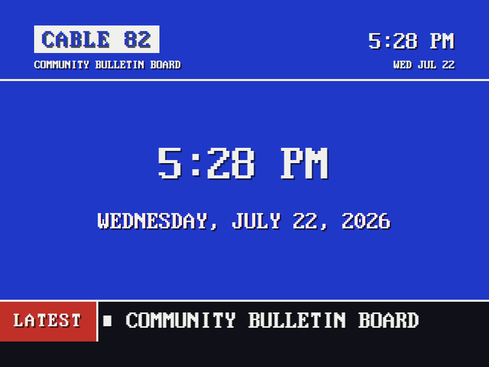
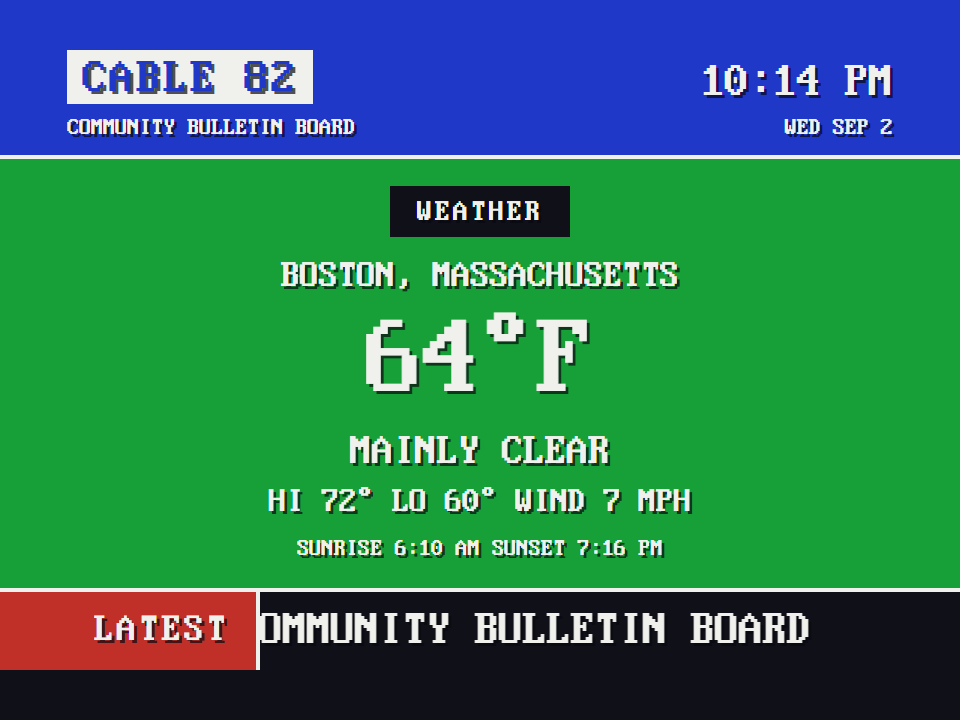
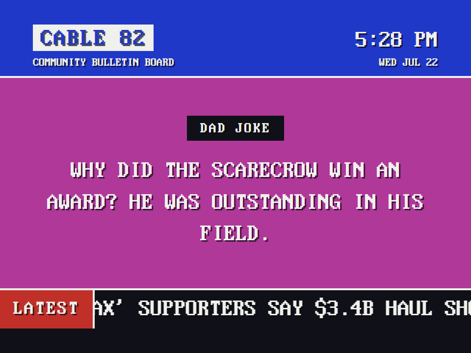
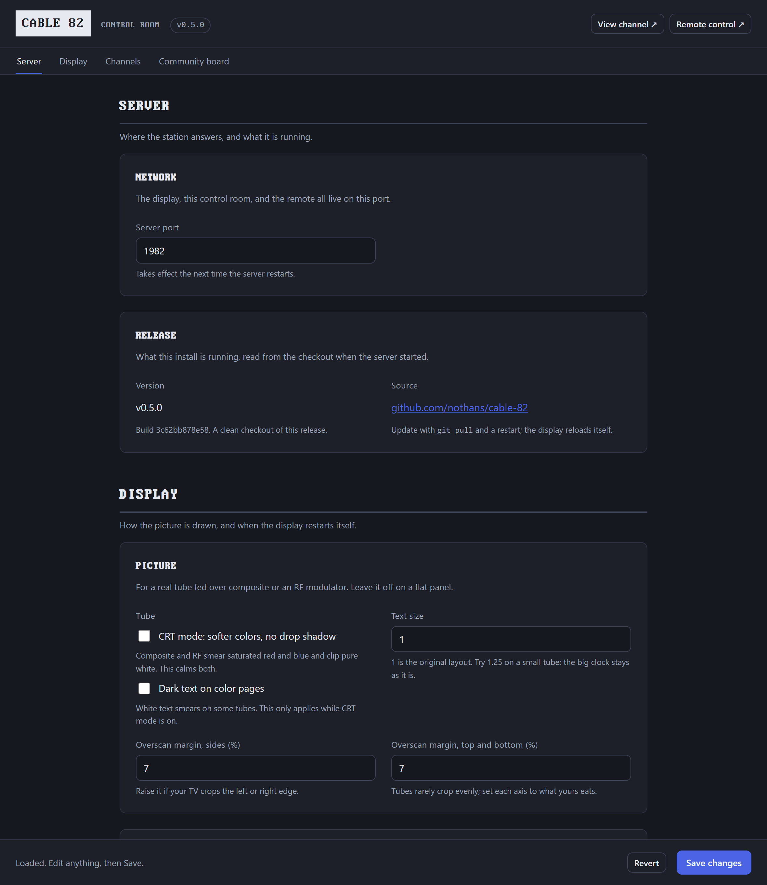
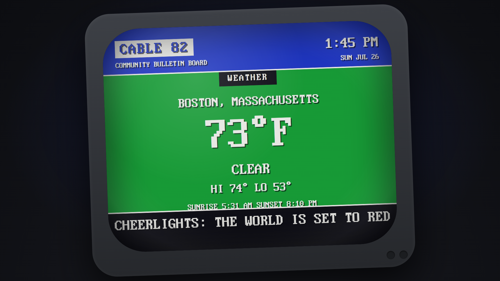

# CABLE 82

Your own 1982 cable community bulletin board channel.

Before feeds, your town had a channel: blue screens, chunky text, the time and temperature, the church bake sale, headlines crawling along the bottom.
CABLE 82 recreates that channel and points it at your life.
It turns any screen - ideally an old 4:3 CRT fed by a Raspberry Pi - into a scrolling rotation of the date and time, your community messages, fun facts, dad jokes, and live headlines from feeds you choose.

You make the channel yours in a control room at `/config` - or by editing one plain `config.json` file.

Read the [build story on nothans.com](https://nothans.com/cable-82-turn-a-raspberry-pi-and-an-old-crt-into-a-1982-cable-bulletin-board-channel), or watch the [one-minute video of it on the air](https://www.youtube.com/watch?v=d5Jcfx5oN0A).

Weather is one optional strip - current conditions, hi/lo, and sunrise/sunset - fed by Open-Meteo (free, no account). For a full retro weather *channel*, [ws4kp](https://github.com/netbymatt/ws4kp) does that beautifully.

| The time | The weather | A dad joke |
| :---: | :---: | :---: |
|  |  |  |

## Quick start

You need Node.js 18 or newer.

```
git clone <this repo>
cd cable-82
node server.js
```

Open `http://localhost:1982` in a browser.
You are on the air.

Then open the control room at `http://localhost:1982/config`: your name, your messages, your feeds, your colors, your page lineup.
Hit Save and the channel picks it up within about twenty seconds, no reload.
(Prefer a text editor? Everything lives in `config.json`; edit it directly and the channel still updates.)

## The screen

1. **Header band** - channel name and the live time and date, always visible.
2. **Pages** - full-screen colored pages that hard-cut every 12 seconds: a big clock, your community messages, DID YOU KNOW facts, DAD JOKE groaners, a WEATHER card, and headlines.
3. **The crawl** - a continuous ticker of headlines along the bottom, fed by RSS.

## Configuration (control room or `config.json`)

The control room at `/config` is the friendly way in: one screen with the whole channel - identity, timing, feeds, the page rotation, community messages, the crawl, and colors.
Every change is validated on the server, written to `config.json`, and picked up on air.
The two ways in stay honest with each other: if `config.json` changes while a control room is open (a hand edit, or a save from another tab), the open screen warns you, and a stale Save is refused instead of overwriting the newer file.



`config.json` is the file underneath, and you can hand-edit it just as happily.
The keys:

| Key | What it does | Default |
| --- | --- | --- |
| `channelName`, `tagline` | Header identity and crawl fallback text | `CABLE 82` |
| `timeFormat` | `"12h"` or `"24h"` | `12h` |
| `port` | Server port | `1982` |
| `rotation` | The page lineup, in order (`clock`, `messages`, `facts`, `dadjokes`, `weather`, `headlines`) | see file |
| `pageSeconds` | Seconds per page | `12` |
| `feeds` | RSS/Atom feeds: `{ id, label, url }`. The server only ever fetches these URLs | WBUR, Hacker News, nothans.com |
| `refreshMinutes` | Feed re-fetch interval | `10` |
| `maxItemsPerFeed` | Items kept per feed | `20` |
| `crawl` | Which feeds ride the ticker, speed, separator, and the fixed `flag` label pinned to its left | all feeds, `LATEST` |
| `messages` | Your community messages: `{ text, color? }` | examples |
| `facts` | Fun facts shown under a DID YOU KNOW card, one string each | 30-plus samples |
| `dadJokes` | Dad jokes shown under a DAD JOKE card, one string each | 15 samples |
| `weather` | One weather strip via Open-Meteo: `location` (geocoded, with `timezone`), `tempUnit` (`F`/`C`), `windUnit` (`mph`/`kmh`). Set it in the control room | Boston, `F`, `mph` |
| `music` | Background music from the `music/` folder: `enabled`, `shuffle`, `volume` (0-100) | on, shuffled, 60 |
| `cheerlights` | The latest [CheerLights](https://cheerlights.com) color as a crawl item: `enabled`, `template` (`{color}` becomes the color name) | on, `THE WORLD IS SET TO {COLOR}` |
| `colors` | `pageCycle`, `headerBg`, `crawlBg` | period palette |
| `overscanPercent` | Safe margin for CRT overscan, 0-15 | `7` |
| `dailyReloadHour` | Daily kiosk self-reload hour, or `false` | `4` |

Colors are palette names: `blue`, `cyan`, `green`, `yellow`, `red`, `magenta`.
The palette is broadcast-safe on purpose; raw hex works too if you must.

Feeds are fetched by the server, never by the browser, and only URLs listed in `config.json` can be fetched at all.
If a feed goes down, the channel keeps running on the last good copy.
If the network dies entirely, the clock, messages, and facts keep going forever.

## Running it on a real CRT (Raspberry Pi)

On a Raspberry Pi with Raspberry Pi OS:

1. **Get the picture onto the TV.** Two ways in, depending on your Pi and your set:

   - **Coax / antenna input (works on any Pi, and the reliable one):** run HDMI from the Pi into an [HDMI-to-coax RF modulator](https://amzn.to/4ftrKsq), then coax from the modulator into the TV's antenna terminal. Tune the TV to **channel 3 or 4** to match the modulator. Any Raspberry Pi and any CRT with a coax input will do this.
   - **Composite out (older Pi with the yellow AV jack, TV with RCA input):** add to `/boot/firmware/config.txt`:

     ```
     enable_tvout=1
     sdtv_mode=0        # NTSC (use 2 for PAL)
     sdtv_aspect=1      # 4:3
     ```

2. **Run the server on boot** - `/etc/systemd/system/cable82.service`:

   ```
   [Unit]
   Description=CABLE 82
   After=network-online.target

   [Service]
   ExecStart=/usr/bin/node /home/pi/cable-82/server.js
   Restart=always
   User=pi

   [Install]
   WantedBy=multi-user.target
   ```

   Then `sudo systemctl enable --now cable82`.

3. **Chromium in kiosk mode** (autostart or a systemd user unit):

   ```
   chromium-browser --kiosk --noerrdialogs --disable-infobars \
     --disable-lcd-text \
     --autoplay-policy=no-user-gesture-required \
     http://localhost:1982
   ```

   (`--disable-lcd-text` turns off subpixel font smoothing, which tints
   the chunky text pink on some displays. A CRT does not care, but it
   keeps flat screens honest too. `--autoplay-policy=no-user-gesture-required`
   lets the background music start on boot without anyone clicking.)

4. **Stop the screen from blanking**: `sudo raspi-config` > Display Options > Screen Blanking > No.

If the TV crops the edges, raise the overscan margin in the control room (or `overscanPercent` in `config.json`) until nothing is cut off.
There are no fake scanline filters in CABLE 82: the CRT is the filter.

## Music

The real channels were never silent, and neither is CABLE 82.
Drop audio files into the [`music/`](music/) folder and the channel plays them as a continuous background bed behind the pages, looping the whole set (shuffle optional).
Two tracks ship with the channel, a 1980s one and a 1990s one; the rest is up to you.
Turn music on or off, shuffle, and set the volume in the control room.

Browsers block autoplay until a user gesture, so on a desktop the music starts on your first click; on the Pi kiosk the `--autoplay-policy=no-user-gesture-required` flag above starts it from boot.

## CheerLights

The crawl carries one extra item: the latest [CheerLights](https://cheerlights.com) color. CheerLights is a single global color that anyone in the world can set, and every connected light on the planet follows along. CABLE 82 checks it about once a minute (server-side, like every other fetch) and scrolls your message with the color name filled in: `THE WORLD IS SET TO {COLOR}` comes out as `THE WORLD IS SET TO PURPLE`.



Turn it off, or make the message yours, in the control room. Or, by editing the  `config.json`:

```json
"cheerlights": {
  "enabled": true,
  "template": "THE WORLD IS SET TO {COLOR}"
}
```

## Testing

- Server: `node --test test/server.test.mjs`
- Client pure functions: start the server and open `http://localhost:1982/test/harness.html`
- Failure drill: `node server.js --chaos` serves mock feeds that randomly hang and fail, so you can watch the channel shrug it off
- Soak: open `http://localhost:1982/?soak=1` for accelerated page flips and refreshes with stats logged to the console

## Credits

- Typeface: [The Ultimate Oldschool PC Font Pack](https://int10h.org/oldschool-pc-fonts/) by VileR (CC BY-SA 4.0), the IBM VGA 8x16 face. See `fonts/LICENSE.txt`.
- Weather data from [Open-Meteo](https://open-meteo.com/) (free, no API key; CC BY 4.0).
- Spiritual ancestors: every local cable text channel that ever scrolled a bake sale, and [ws4kp](https://github.com/netbymatt/ws4kp) for proving retro TV nostalgia belongs on the web.

## License

MIT for the code (see `LICENSE`).
The bundled font remains CC BY-SA 4.0.
